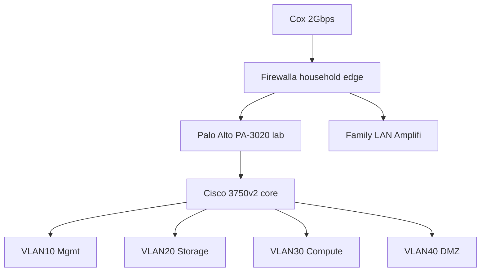

# Antsle Home Lab — Architecture

**Author:** David Wilson  
**Version:** 1.0  
**Status:** Draft (execution started 2026-05-17)  
**Canonical source in this repo:** [Lab-Architecture.md](Lab-Architecture.md) (tracked Markdown conversion)

> **Document hierarchy:** This file is the primary design for the four-machine lab. Step-by-step Antsle/TrueNAS work is tracked as an external manual import until the docx is re-added; see [source-manuals-status.md](source-manuals-status.md). Signed decisions: [decisions.md](decisions.md).

---

## Introduction

Four-machine home lab built from gear already on hand: Antsle One (storage), Mac Pro 5,1 (data engineering), MSI Codex (AI/ML), MacBook M1 (thin client), plus Cisco Catalyst 3750v2 and Palo Alto PA-3020 for enterprise-style segmentation.

**Portfolio goal:** Multi-tier infrastructure, real network policy, data pipeline + MLOps loop, documented reasoning at every layer.

**Out of scope here:** Per-machine step-by-step builds (Antsle manual is first; Mac Pro/MSI manuals to follow).

---

## 1. Target architecture

### 1.1 Hardware at a glance

| Machine | Primary role | Key specs |
|---------|--------------|-----------|
| Antsle One | Storage + infra backbone | Atom C3758, 64GB ECC, ZFS mirror 2×1TB SSD |
| Mac Pro 5,1 (4,1→5,1 flash) | Data engineering | 12C/24T Xeon, 64GB RAM, 4TB HDD |
| MSI Codex ZS 5TC | AI/ML workstation | Ryzen 7 5700G, RTX 3060 Ti 8GB, 16GB DDR4 |
| MacBook M1 | Thin client / control plane | Daily driver, no persistent lab state |
| Cisco 3750v2-48PS-S | Lab core L3 switch | VLANs, ACLs, PoE |
| Palo Alto PA-3020 | Lab perimeter NGFW | Policy zones (no threat licenses) |

### 1.2 Role rationale

- **Antsle:** I/O-bound, ECC, fanless, 25W — source of truth for personal data; not general compute.
- **Mac Pro:** Parallel DB/analytics; Postgres/MinIO/Airflow/Jupyter on Linux + Docker.
- **MSI:** Only GPU; local LLM (7B–13B quantized), SDXL, RAG, small LoRA fine-tunes.
- **MacBook:** Browser, SSH, remote Jupyter — if it fails, lab state survives.

### 1.3 Network topology

### 1.4 Data resilience (personal / Antsle)

| Layer | Location | Purpose | Recovery |
|-------|----------|---------|----------|
| Live | Antsle ZFS mirror | Daily data | Instant |
| Snapshots | Antsle | Undo mistakes | Seconds |
| Cloud | Google Drive | Offsite copy | Minutes |
| Cold | WD My Cloud offline | Ransomware/disaster | Hours |

Mac Pro/MSI data is **ephemeral by default**; promote worth-keeping artifacts to `tank/projects` on Antsle.

---

## 2. Hardware inventory

See docx for full tables and estimated used-market values (~$3,550–$5,400 total assets).

**Adjacent:** WD My Cloud EX2 Ultra → cold backup after Phase 2; Tailscale for personal remote access.

---

## 3. Network design

### 3.2 VLAN scheme

| VLAN | Subnet | Purpose |
|------|--------|---------|
| 1 | family-lan-subnet | Family LAN (untouched) |
| 10 | lab-mgmt-subnet | Lab management |
| 20 | lab-storage-subnet | Lab storage |
| 30 | lab-compute-subnet | Lab compute |
| 40 | lab-dmz-subnet | Lab DMZ (reserved) |
| — | 100.x.x.x | Tailscale mesh |

### 3.3 IP plan

| Device | VLAN | Address reference |
|--------|------|-------------------|
| Palo Alto mgmt | 10 | mgmt-gateway |
| Cisco mgmt | 10 | mgmt-switch |
| Antsle IPMI | 10 | host-03-host |
| Antsle data (LAN1) | 20 | antsle-storage-host |
| Mac Pro | 30 | host-05-compute-host |
| MSI | 30 | host-06-compute-host |
| MacBook (admin) | 10 | admin-client-dhcp |

### 3.4 Remote access

**Tailscale** — primary daily remote path (WireGuard mesh, no port forward).

**GlobalProtect** on PA — optional learning exercise; not primary.

### 3.5 Firewalla

**Signed:** Option B — Firewalla = household edge; PA-3020 = lab only. See [decisions.md](decisions.md).

---

## 4. Per-machine roles

### 4.1 Antsle — TrueNAS Scale

- Pool `tank`: mirror 2× MX500; boot Samsung 980 NVMe
- Apps (phased): Nextcloud, Vaultwarden, Pi-hole, Jellyfin, Syncthing
- **Execution source tracking:** [source-manuals-status.md](source-manuals-status.md)

### 4.2 MSI — AI/ML

- Ubuntu/Debian + NVIDIA + Docker
- Ollama/vLLM, Open WebUI; MinIO pull/push for artifacts
- RAM upgrade to 32GB if stacked workloads hurt (~$50–80)

### 4.3 Mac Pro — data platform

- Postgres, MinIO, Spark (single-node), Airflow, Jupyter Hub
- Optional 1–2TB SSD for hot data if HDD bottlenecks (~$80–130)

### 4.4 MacBook — thin client

- Remote Jupyter, SSH admin, coursework; no heavy local workloads

---

## 5. Storage architecture

| Tier | Host | Durability |
|------|------|------------|
| Personal | Antsle `tank` | 3-2-1 + snapshots |
| Data eng | Mac Pro | Ephemeral; promote to `tank/projects` |
| ML artifacts | MinIO → promote when final | |

---

## 6. MLOps loop (Phase 6)

1. MacBook → Jupyter on Mac Pro  
2. Read raw data (MinIO + Postgres)  
3. Transform (Spark/pandas) → features to MinIO  
4. MSI pulls features over VLAN 30  
5. Train on RTX 3060 Ti  
6. Push model artifact to MinIO  
7. Ollama inference on MSI  
8. MacBook RAG query (Postgres context)

**Done condition:** Reproducible end-to-end run + Notion portfolio writeup.

---

## 7. Build phases

| Phase | Name | Done condition |
|-------|------|----------------|
| **0** | Physical reassembly | All boxes POST, RAM/drives visible | → [phase-0-checklist.md](phase-0-checklist.md) |
| **1** | Network foundation | 4 VLANs routable; PA policy; family LAN OK | → [phase-1-network-checklist.md](phase-1-network-checklist.md) |
| **2** | Antsle build | Data on Antsle; snapshots; 1x cold backup | See source-manuals status |
| **3** | Antsle services | Third-party tools retired |
| **4** | Mac Pro platform | Jupyter + Postgres + MinIO + Airflow DAG |
| **5** | MSI workstation | LLM + RAG demo from MacBook |
| **6** | MLOps loop | Full pipeline + portfolio doc |
| **7** | Cyber (deferred) | SIEM / attack range TBD |

---

## 8. Cost model

**Incremental spend (gated):** ~$160–240 (Mac Pro SSD, MSI RAM, cables).

**Existing assets:** ~$3,550–$5,400 estimated used value.

Measure power with Kill-A-Watt in Phases 1–2 (Cisco ~100W, PA ~75W, Mac Pro 200–300W, Antsle ~30W idle).

---

## 9. Risks

- Mac Pro HDD IOPS — SSD in Phase 4 if needed  
- MSI 16GB RAM — upgrade if needed  
- PA-3020: no threat licenses (stateful firewall still valuable)  
- Cisco 3750v2: loud; rack behind closed door  
- WD cold backup hardware aging — plan B2/rotating drives later  

---

## 10. References

- [source-manuals-status.md](source-manuals-status.md)
- [TrueNAS Scale docs](https://www.truenas.com/docs/scale/)
- [Tailscale KB](https://tailscale.com/kb/)
- Root [README.md](../README.md)

---

## 11. Status

§11 sign-offs recorded in [decisions.md](decisions.md). Execution began Phase 0 on 2026-05-17.
